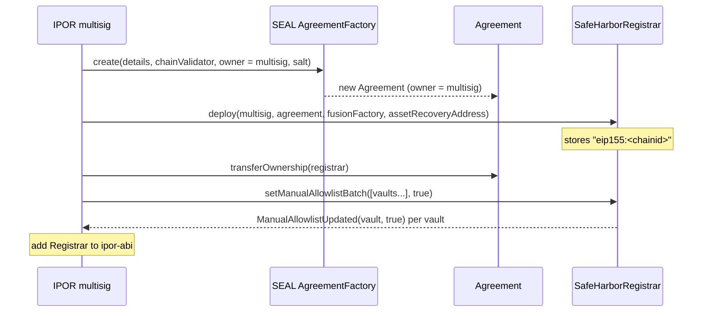
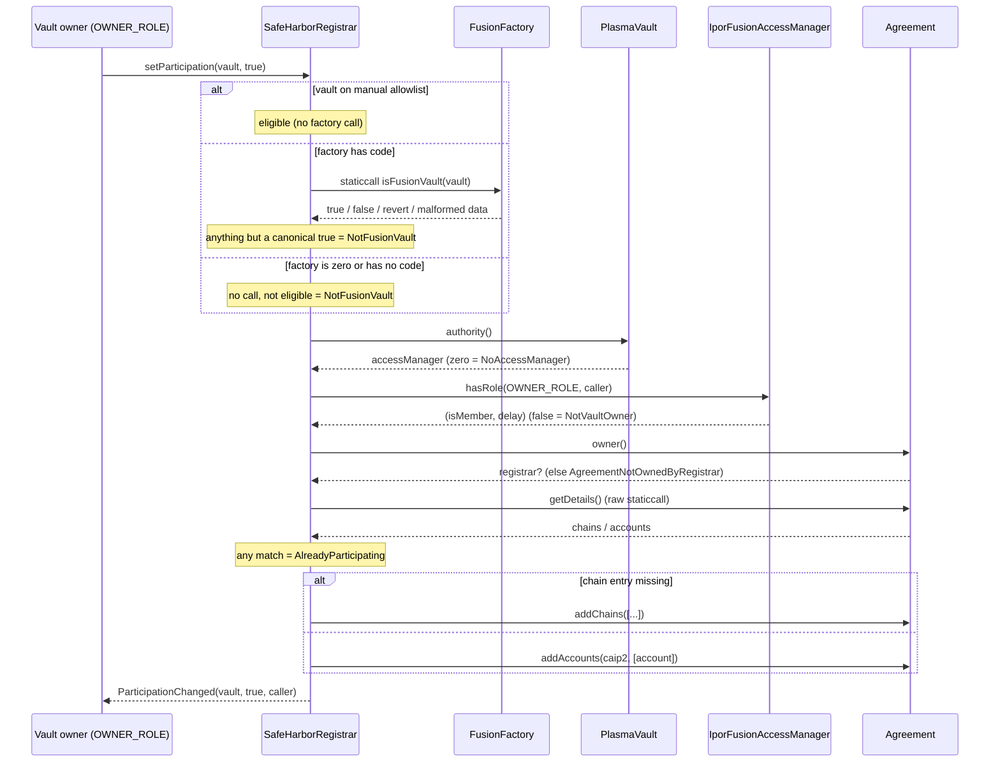
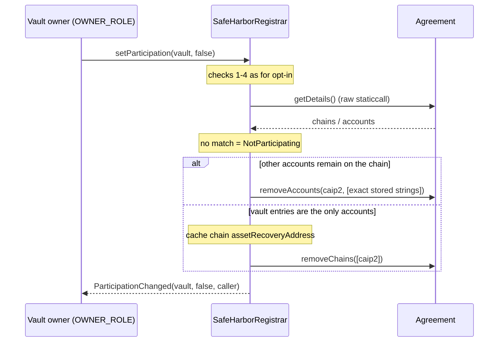

# SafeHarborRegistrar

## Overview

[SEAL Safe Harbor](https://github.com/security-alliance/safe-harbor) is a legal framework under which
whitehats may rescue funds from a protocol's contracts during an active exploit. A protocol adopts it by
deploying an on-chain `Agreement` (via the SEAL `AgreementFactory`) that lists, per chain, the accounts in scope
and the address recovered assets must be returned to. `Agreement` is `Ownable`: only its owner can change the
covered accounts.

`SafeHarborRegistrar` lets IPOR delegate the per-vault decision to each Plasma Vault's owner **without handing out
the Agreement itself**:

- **One Registrar per chain.** The CAIP-2 chain id `eip155:<block.chainid>` is computed once in the constructor
  and stored (Solidity has no `immutable string`).
- **The Registrar owns the Agreement** while it operates. It is the only writer of the chain's account list.
- **Vault owners decide.** An account holding `OWNER_ROLE` (id `1`) on the vault's `IporFusionAccessManager`
  opts the vault in or out with one transaction.
- **Only genuine Fusion vaults can enter.** A vault is eligible when it is on the owner-curated manual allowlist
  **or** when `FusionFactory.isFusionVault(vault)` returns true (IL-8227). A factory that is not deployed, lacks
  the selector, reverts or returns malformed data simply answers "false".
- **No local participation state.** `isParticipating` is answered by reading the Agreement, so the Registrar never
  drifts from the legal source of truth.
- **Not upgradeable.** The replacement path is `transferAgreementOwnership`.

**Location:** `contracts/safe-harbor/`

| File | Purpose |
|------|---------|
| `SafeHarborRegistrar.sol` | The contract (`Ownable2Step`) |
| `ISafeHarborRegistrar.sol` | External API, events, custom errors |
| `IFusionFactoryVaultCheck.sol` | Minimal `isFusionVault(address)` view of the FusionFactory (IL-8227) |
| `ext/IAgreement.sol` | Vendored SEAL types and the `Agreement` subset used, pinned to upstream commit `78ba9237377a9622439cbab41a5336673cea1b92` |

## Trust Model

| Actor | Powers |
|-------|--------|
| Registrar owner (IPOR multisig, `Ownable2Step`) | `setManualAllowlist`, `setManualAllowlistBatch`, `forceRemove`, `setAgreement`, `transferAgreementOwnership`, `setAssetRecoveryAddress`, two-step ownership handover. `renounceOwnership` is disabled. |
| Vault owner (`OWNER_ROLE` on the vault's access manager) | `setParticipation(vault, true/false)` for that vault only. Execution delay of the role is ignored; membership alone decides. |
| FusionFactory | Trusted oracle of genuineness once IL-8227 is deployed. Its "true" is final; any failure counts as "false". |
| Agreement | Trusted SEAL contract owned by the Registrar. |

## Deployment Flow

1. Create the Agreement through the SEAL `AgreementFactory.create(details, chainValidator, owner = multisig, salt)`.
   `details.chains` may already contain other chains; the Registrar only ever touches `eip155:<this chain>`.
2. Deploy `SafeHarborRegistrar(multisig, agreement, fusionFactory, assetRecoveryAddress)`.
   - `multisig` zero → `OwnableInvalidOwner`, `agreement` zero → `Errors.WrongAddress()`, empty
     `assetRecoveryAddress` → `EmptyAssetRecoveryAddress()`.
   - `fusionFactory` is **immutable** (no setter). It may be `address(0)` while IL-8227 is not deployed; that Registrar
     is then permanently allowlist-only. Automatic recognition only ever comes from the configured address once it
     implements `isFusionVault` (for example the FusionFactory proxy after an upgrade). Pointing at a different factory
     means deploying a new Registrar and handing the Agreement ownership over with `transferAgreementOwnership`.
3. Multisig calls `Agreement.transferOwnership(registrar)` (single-step upstream `Ownable`, effective immediately).
4. Multisig bootstraps the allowlist for vaults deployed before IL-8227: `setManualAllowlistBatch([vaultA, vaultB, ...], true)`.
5. Register the Registrar address in `ipor-abi`.



## Vault Opt-In Flow

`setParticipation(vault, true)` performs the following checks in order. The first failing check reverts and nothing
is written.

| # | Check | Revert |
|---|-------|--------|
| 1 | `manualAllowlist[vault]` **or** guarded `FusionFactory.isFusionVault(vault)` | `NotFusionVault(vault)` |
| 2 | `IAccessManaged(vault).authority() != address(0)` | `NoAccessManager(vault)` (a vault without the `authority()` selector reverts with the raw error) |
| 3 | `IAccessManager(authority).hasRole(OWNER_ROLE, msg.sender)` returns `isMember == true` | `isMember == false` → `NotVaultOwner(vault, caller)` (an authority that is not an AccessManager, or a failing `hasRole` read, reverts with the raw error) |
| 4 | `Agreement.owner() == registrar` | `AgreementNotOwnedByRegistrar(agreement, currentOwner)` |
| 5 | vault not yet listed on this chain (case-insensitive scan of the Agreement) | `AlreadyParticipating(vault)` |

Then the vault is added as `Account({accountAddress: <lowercase hex>, childContractScope: None})`:

- chain entry `eip155:<chainid>` absent → `Agreement.addChains([Chain(assetRecoveryAddress, [account], caip2)])`
- chain entry present → `Agreement.addAccounts(caip2, [account])`

and `ParticipationChanged(vault, true, caller)` is emitted.



## Vault Opt-Out Flow

`setParticipation(vault, false)` runs checks 1–4 from the opt-in table, then:

| # | Check | Revert |
|---|-------|--------|
| 5 | vault listed at least once on this chain | `NotParticipating(vault)` |

Removal covers **every** matching entry (case-insensitive comparison of the stored `accountAddress` with the vault's
hex address, exact stored strings are passed back to the Agreement):

- matches < accounts on the chain → `Agreement.removeAccounts(caip2, [exact strings...])`
- matches == accounts on the chain → the chain's current `assetRecoveryAddress` is cached in the Registrar
  (`AssetRecoveryAddressUpdated` if it differs) and `Agreement.removeChains([caip2])` is called, because upstream
  forbids a chain with zero accounts and forbids removing the last account.

`ParticipationChanged(vault, false, caller)` is emitted. Chains other than the current one are never touched.



## Owner Operations

| Function | Behaviour |
|----------|-----------|
| `forceRemove(vault)` | Removes the vault like an opt-out, but skips eligibility, `authority()` and role checks. Requires Agreement ownership (`AgreementNotOwnedByRegistrar`), reverts `NotParticipating` when the vault is not listed. Emits `ParticipationChanged(vault, false, owner)`. Only entries whose stored string is a hex address can be targeted. |
| `setManualAllowlist(vault, allowed)` | Zero address → `Errors.WrongAddress()`. Always emits `ManualAllowlistUpdated(vault, allowed)`. Removing a vault from the allowlist does **not** remove it from the Agreement; use `forceRemove`. |
| `setManualAllowlistBatch(vaults[], allowed)` | Atomic: empty array → `Errors.WrongValue()`, any zero address → `Errors.WrongAddress()` and nothing is written. One `ManualAllowlistUpdated` per input address, in input order; duplicates are allowed and idempotent. |
| `setAgreement(newAgreement)` | Zero address → `Errors.WrongAddress()`. Pointer switch only. Participants are **not** migrated and the new Agreement's ownership is not verified (point first, transfer ownership later). Emits `AgreementUpdated(old, new)`. When retiring an Agreement, call `transferAgreementOwnership` on it **before** switching, otherwise its ownership stays with the Registrar. |
| `transferAgreementOwnership(newOwner)` | Zero address → `Errors.WrongAddress()`. Calls `Agreement.transferOwnership(newOwner)` (single-step, immediate). Emits `AgreementOwnershipTransferred(agreement, newOwner)`. After transfer away from the Registrar, `setParticipation` calls passing checks 1–3 fail at check 4 with `AgreementNotOwnedByRegistrar`; owner-authorized `forceRemove` fails its Agreement-ownership check directly. Earlier errors retain precedence; views and Registrar-only configuration remain available. Resume with `Agreement.transferOwnership(registrar)`. |
| `setAssetRecoveryAddress(string)` | Empty string → `EmptyAssetRecoveryAddress()`. Used only when the Registrar has to (re)create the chain entry. Precedence: the value cached at the last-account opt-out overrides an earlier setter call; to change the recovery address for the re-created entry, call the setter while no vault participates. |
| `transferOwnership` / `acceptOwnership` | OpenZeppelin `Ownable2Step`: the new owner must accept. |
| `renounceOwnership()` | Always reverts with `RenounceOwnershipDisabled()`. |

## Views

| Function | Returns |
|----------|---------|
| `isParticipating(vault)` | True when at least one account on the current chain matches the vault (case-insensitive), read live from the Agreement. |
| `isEligibleVault(vault)` | `manualAllowlist[vault] || isFusionVault(vault)` with the guarded factory call. |
| `isManualAllowlisted(vault)` | Manual allowlist entry. |
| `getAgreement()` | Managed Agreement. |
| `getFusionFactory()` / `FUSION_FACTORY()` | Configured FusionFactory (zero when not configured). |
| `getCaip2ChainId()` | `eip155:<chainid>` stored at deployment. |
| `getAssetRecoveryAddress()` | Recovery address used for the next chain-entry creation. |

## Operational Notes and Residual Risk

- **Participation state lives only in the Agreement.** `isParticipating`, `setParticipation` and `forceRemove` read
  `getDetails()` with a raw staticcall (the whole Agreement payload is copied) and walk the ABI-encoded bytes with a
  bounds-checked reader down to the current chain's accounts (the nested `AgreementDetails` struct cannot be
  ABI-decoded by the legacy codegen without via-ir, which is forbidden in this repo). Every offset, count or string
  length the reader visits must fit the returned data, otherwise it reverts with `MalformedAgreementData()`; fields
  the reader skips (contacts, bounty terms, other chains' accounts) are not validated. A reverting `getDetails()`
  bubbles its own error. Configuration getters and the allowlist setters do not touch the Agreement.
- **Gas grows linearly** with the size of the Agreement payload and the number of accounts on the current chain for
  every participation lookup, opt-in, opt-out and `forceRemove`. There is no hard cap: Registrar additions require
  eligibility, but entries imported while another owner held the Agreement (including duplicates) count too, and
  the factory's admission policy decides how many genuine vaults can exist.
- **Escape hatch:** `transferAgreementOwnership(multisig)` does not use the reader. The multisig can then clean the
  Agreement directly in bounded calls (`removeAccounts`, `removeChains`, `setChains`) and hand ownership back with
  `Agreement.transferOwnership(registrar)`.
- **Manual edits while the Registrar owns the Agreement are impossible** (only the owner can write). Entries imported
  earlier with mixed-case addresses or duplicates are recognised and removed in full by the next opt-out.
- **IL-8227 dependency:** until the configured FusionFactory exposes `isFusionVault`, every vault must be allowlisted
  by the multisig. If the configured factory address implements `isFusionVault`, vaults it reports true become
  eligible without manual approval; a zero-factory Registrar remains manual-only.
- **No `indexed` event parameters** (IPOR convention); index off-chain by data.

## Testing

```bash
# unit tests (mocked Agreement and FusionFactory, real IporFusionAccessManager)
forge test --match-path test/safe-harbor/SafeHarborRegistrarTest.t.sol

# live-vault fork tests (ETHEREUM_PROVIDER_URL in .env, pinned block 25952115)
forge test --match-path test/safe-harbor/SafeHarborRegistrarForkTest.t.sol -vv

# everything
forge test --match-path 'test/safe-harbor/*'
```

The fork suite deploys only the Registrar and a fresh Agreement through the real SEAL `AgreementFactory`
(`0xcf317fE605397bC3fae6DAD06331aE5154F277fF`, validator `0xd01C76ccE414d9B0a294abAFD94feD2e0B88675D`). Vaults, their
access managers and `OWNER_ROLE` holders are live Ethereum state; the deployed FusionFactory proxy
(`0xcd05909C4A1F8E501e4ED554cEF4Ed5E48D9b852`, no `isFusionVault` yet) is used as is. The multisig allowlists the
first two vaults with `setManualAllowlistBatch` in `setUp`; the third is allowlisted inside the delayed-owner test:

| Vault | Access manager | `OWNER_ROLE` holder |
|-------|----------------|---------------------|
| `0x2D71CC054AA096a1b3739D67303f88C75b1D59dC` | `0xCc9A3e8205AB60e613A044eFcEa5d3479187aceE` | `0x838293B726A34eDf8d4dbDa7C273F59F1482F606` (delay 0) |
| `0xe9385eFf3F937FcB0f0085Da9A3F53D6C2B4fB5F` | `0x3dF9d7BE4017e3d72eA39b96eD4C7070c19eAbaE` | `0xFbA787bB75d6D0F7fad188De9F12650323b35D87` (delay 0) |
| `0x43Ee0243eA8CF02f7087d8B16C8D2007CC9c7cA2` | `0x818912488f1023419426d1410D351d7Daa7dF7Aa` | `0xF6a9bd8F6DC537675D499Ac1CA14f2c55d8b5569` (DAO Safe, delay 14 days) |
